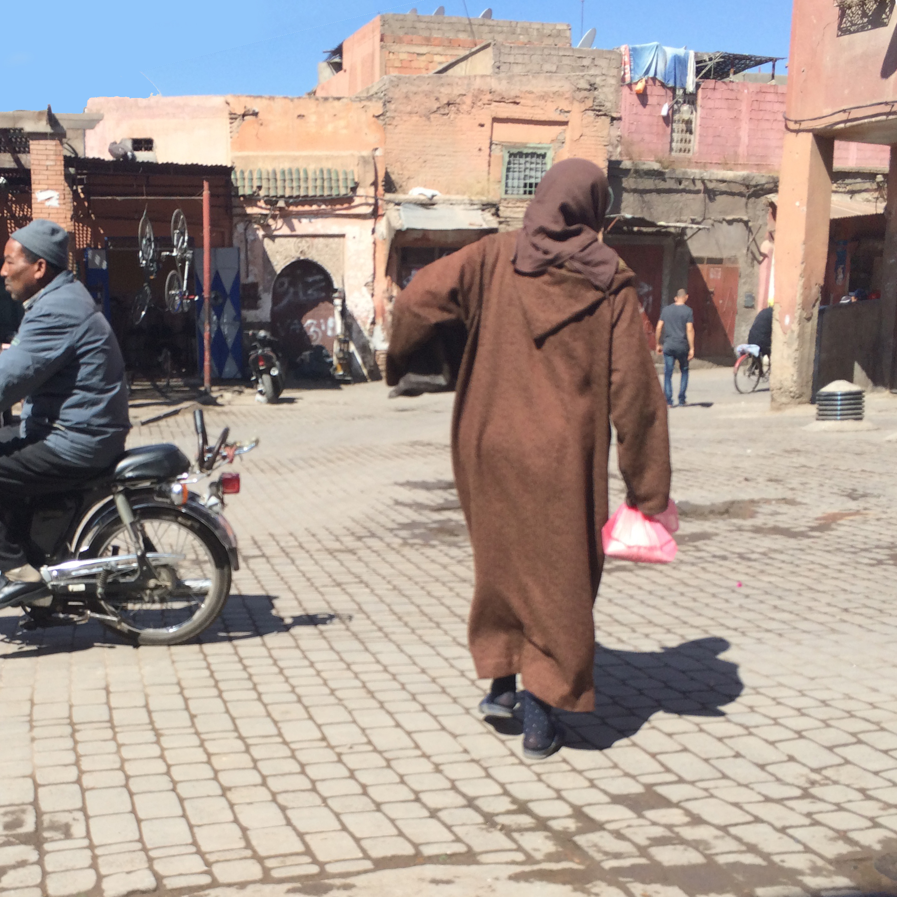

# 4 May 2015: 

## London Gatwick 

5am alarm goes off.  Time to catch my flight.  Grab a couple of bottles of scotch for my guide in Marrakech. Easyjet is not the friendliest of airlines, but the flight is only 3 hours.   Halfway through there’s one man dressed in traditional Arab clothing.   The flight attendant tells him to put his phone in airplane mode, about 1.5 hours into the flight. He’s clearly traveling with 3 other people.  Three on the other side of the aisle in my row the 4th is on my side of the aisle.  5 minutes later two of the men get up and walk to the front of the plane, one gets in the bathroom and the other, he waits by the door.  The man in traditional Arab clothing raises the armrests and turns 15 degrees to the left and starts bowing.  Obviously praying towards Mecca.  The remaining person starts up a conversation with me about the trip, was it my first time to Morocco etc.  Then I finally realize what has been happening.  The 4 are friends traveling for a vacation.  One is far more religious than the others and wanted to pray, the Salat apps only work with GPS turned on (so it can tell you which direction to face).  The two others used the bathroom so he had room to pray.  It was then I realized that it was time to forget anything the American media has told you about the Muslim faith and the Arab world.

## Touchdown Marrakech 
Touchdown Marrakech, I go through the airport.  Grab a free sim card, as they give them to everyone coming into the country.  A genius idea so I can call home if I need to, or if you’re a nerd like me get the internet so navigation, research, and contact home is available.  Over the next day or so I spend about half an hour getting the internet working for the phone but with the maze of roads and the lack of a guide means that the alternative to having a working phone is traveling like a tourist.  So I get through security and am greeted by a sign letting me know the name of the hotel that I’m going to.  He greets me and asks if its only me and we’re off.   The airport and the surrounding areas are grand sweeping areas.   No one is in a particular hurry, the taxi driver is friendly but doesn’t speak much English. No worries, I’m just taking it all in.  We get to the car and the first song to greet me is some Destiny’s Child song.  I laugh at it and then after it’s done , he turns the radio over to a station in Arabic and we’re deeply into the unfamiliar.  

The rules of the road are vastly different.  There seems to be some sort of separation for scooters but any lane lines are completely ignored.  At one light someone in the taxi next to us.  Gets out and then just climbs on the back of the scooter stopped right next to the taxi.  The other two passengers in the taxi just sat there as if this were not unusual.  We cross through what seem to be several private estates, or hotels.  Big walled in sections with the street running straight through them.   Finally we leave the wide open spaces of the New City and reach the Medina.   The roads become similar to a pedestrian walkway that we are driving down. 5 Miles an hour is an absolute top speed, but luckily we don’t have far to go, every 100 yards or so there’s a square.  We stop in a place, thus after known as “Welcome to Africa Square”, which is chaotic.  There’s a functional fountain in front of the car from which some merchants are filling buckets of water.  Around the perimeter of the square there is a row of old men sitting in the shade of some structures coming out from the buildings.  They look like pergolas but there are small remnants of roof parts on them.  

All of a sudden, we come to a stop.  A man walks up quickly and reaches into the car.  Says a few things to the driver, and asks if I can pay the driver the 150 dh I owe him.  I say I have 200dh bills only.  He takes one from me, walks over to a stall and then comes back with the 150dh for the driver and the 50dh change for me.  He then introduces himself as the manager of the house I’m staying at.   He guides me out of the car, and down a set of narrow (as if there is any other kind in this city) alleys, to a metal cage of a door.  He pushes a button and someone comes to the door to let us in.   Through the inner door.  He directs me to my room, and shows me the toilet for the floor (We got our own showers just not the commode).  Then we go back down to the center of the house and he instructs me to sit down.  Asks if I want tea, and asks for my passport so he can do some paperwork.  Tea! Yes, this was one of the try.  

Moroccan tea is great, I’m later told it’s basically just cheap green tea poured over a ton of mint. I swear I taste black tea in there as well but I am probably mistaken.  The manager takes a pot of tea, puts a cube of sugar in the bottom of a small narrow glass.  The then starts to pour it into the glass and over the sugar.  The sugar is not like any sugar I’ve seen before, its grains are large and it’s not exactly square, it looks like someone’s first attempt at a sugar cube.  He pours it from like a foot or two above the glass. It foams up nicely and I take my first sip.  It’s beautiful. It’s transcendent.  It’s the finest cup of tea I’ve ever had in my life.  It tastes like someone took a good cup of English tea, mixed it with some southern sweet tea, mixed in some Asian green tea and then threw a bit of mint on it.   It reminds me of all of my past.   The British Teas of my summers with Grandma.  The sweetness of the Florida Sweet Tea of Mrs Cole.   I realize at this point that my trip is going to awaken parts of me I hadn’t even imagined.   

## Exploring and starting to get the city.
The manager suggests I go to the main square (Jemaa el-Fnaa),  he’s going to walk me to it.   He shows me the series of turns to get me to a road, and “Welcome to Africa Square”.  We walk down the road through “Fish Square” and then I’m instructed to turn at this particular intersection.  It is almost doubling back on myself and I was afraid I would forget which one it was.  Then I saw this sign that said “Cyber Internet” which is somehow 40 years old.  I know that is a noticeable landmark and commit it to memory.  I then walk down that street through “Wall Market” and “Chicken square”, to reach the berber market.  I continue straight and finally reach the main square. The main square is largely anticlimactic.  The entire route from the hotel has been lined with vendors, its early in the day, so half of them are still shuttered, or just setting up.    But it’s still largely overwhelming.   There's voices calling out to you almost constantly.  Some of them, trying to sell you something, anything.  Some of them trying to scam you.   The most common of these scams is to tell you that you are heading the wrong way and try to direct you to the "main square".  Once they take you somewhere, often actually where you are trying to go,  they will ask for some sort of payment for their troubles.  But, more on that later.  

I cannot recommend the idea of going to the market before its fully open if possible.  It allows you to ease into the process, and get accustomed to the noise and chaos.  The odd thing about the square is that it is about as chaotic as most of the roads coming up to it but since it is not nearly as compact its honestly less overwhelming.   There's space for the noise to dissipate.  You're far less likely to lose yourself in a labyrinth of streets and markets.

I decided that I had wandered enough, and that I wanted to return to the Riad and Take a nap.   I looked for food on the path home but found nothing that fit my criteria, which was for a place to serve food that was easy to eat (either on a stick or wrapped in bread or the link, and for the place to be busy but not too busy.  Too busy and I felt my presence would upset the locals with my inability to know what to do. Too empty and I would be sure that the product would be no good.   I was really hoping for places that had one item for sale but that was a negotiable point.  Unfortunately my set of criteria and the path I took meant I did not find anything this particular day.  As I wandered into "Welcome To Africa Square" I remembered the small convenience stand and the suggestion not to drink the tap water.  I figured it was a good time to buy a coke (and learn to navigate the money).  They only had 1 liter bottles of coke so All i had to do was say "coke" and hand over some paper.  Trusting these people to help me out and give me the correct change was my plan.  They were trusted by my friend the manager and so I was ready also to extend my trust.  It was not misplaced and they handed me back my 42 dh of change.  It seems as though there was an odd pattern about handing money.  Coins seemed to be placed on a counter and paper money directly handed.  I had heard of cultures where money is placed on the counter and others where it is always passed directly.  This combination though was strange and surprising.  It seemed to hold true for all my business that was performed with locals expecting locals.  When in more touristy areas that seems to be less hard and fast, and it might have just been the people I dealt with as no guide books had advised me on this peculiarity.  

Back home and a nap with the window open and the breeze floating through was magnificent. I awoke at about 4:30 refreshed and ready for more of the city.  It felt extremely useful to have these little breaks, particularly in the adjusting to the pace of the city which was fast and hectic and chaotic.   It seemed that about 5 pm the school children from the school house next door were just getting off of school which seemed odd to me, because these were young kids.  Schooling seemed to consist very highly of almost solely of singing songs in unison.  I'm certain that it was because this was the easiest way for me to identify schools by the sounds of many young children signing together.  The mothers were gathered by the door to collect their little ones. And at 5:08 the call to prayer echoed over the city.  I made note of the time so that the next day I would be in a spot to better enjoy it.  I decided to take some time then to wander and get dinner before the sun was too far down.  I was not entirely prepared for the night there and so I did not want to be overwhelmed by it.  

There was some good time to reflect and look about the city from the top of the Riad.  Each place is its own fortress, ensuring you peace from the chaos.  A life here is lived at 2 speeds.  The first being the market which is as fast as you can imagine, with disorder and urgency being the kings.   Second is home which is quiet and calm and organized.   The gracious geometric order of the residences themselves seems to stand in direct opposition to the disorder of the city.   It draws comparisons to so many aspects of the physical world where the microscopic is ordered and regular but the macroscopic is chaos.  It makes you think of the beauty of geodes, or of a a Christmas tree farm where the trees are planted without order. Each little fractal on its own is beauty and order personified, but when the forest is seen there is a mass of chaos.

## The Market and Dinner: 

  
At 7 pm I was walking about the town and looking for food.  There still seemed to be much of the organized singing of songs by children in different buildings, to which I had no theories as to why.  I knew the main square was where there was much food and it would all be set up by now.  7 pm is apparently rush hour the streets are filled with motored cycles.   Vendors opening their shops for the evening.  I feel happy that I did not bring anyone as I feel like i could not be vigilant for anyone but myself alone, a task of its own that seems daunting.  I make my way to the square and wander around the food portion which is full now but during the day is almost entirely empty.   I decide I am not simply going to stop at the first place, but look at all the stands first and then make my decision.  I walk around for a bit where each stall has someone with a menu who tries to address me in whatever language they think I speak, and invite me in.   There is much order to the stands, there seem to be several archetypes for the stand and they seem to be arranged by those types.  The seafood specialists are next to the other seafood places, the meat with the meat.   I wander around and for the first time in my life I am hit with a slur.   At my dismissal to one of the ad men who tried to lure me into his stand, he waved me off and called me a "Fish-and-chips" which I can easily assume meant that I was a tacky British tourist.   Being a completely new experience for me I was not particularly upset at this newly discovered (discovered as in Columbus) slur that my initial reaction was to laugh at it.    I continued walking and was soon overwhelmed by my choices  so I decided the trick was to sit down at the stand with the most arab speaking people and order whatever they did.  

I sat down at this one stand and they were all eating this soup.  It seems to be the right thing for me so I sit down and gesture to the man serving that I want what they have.  Three other Europeans follow my lead and sit down next to me.  To which he gives me a bowl and a spoon and I dig in.  The soup is interesting,  it has  a great many of components to it.  Almost like the recipie is to take all the ingredients in your kitchen and then throw them in a big steel pot and heat for hours.  Later, I've figured out that it is "Harira" a specialty of the Berbers, comprised of Tomato, lentils, chickpeas and all manner of vegetables. Seasoned with parsley coriander saffron ginger and pepper.  The soup itself is made of many vegetables and herbs and spices, but ends up tasting like spaghetti-o's without the "o's".   I take time to finish my bowl and my European friends get up to go.  The manager of the spot walks over and asks them for 20 dh.  They seem confused as to why it was costing them more, after a few seconds of butchered French it is determined that I am not with them and they aren't paying for my dinner.  I am offered another bowl of soup to which I agree both because I am hungry and because I am quite happy to eat this delicious soup.  So I finish my second bowl and I get up to pay and leave.   They charge me 5 dh (about 50 US cents) and I'm on my way.  I make my way back to the Riad stopping to buy a Coke from my friends and settle in for the night.  Its already quite dark and I am not ready for that.  As the night gets darker the heat from the day leaves and it becomes pleasant to sleep, I drift off to the sounds of David Attenborough on my phone.